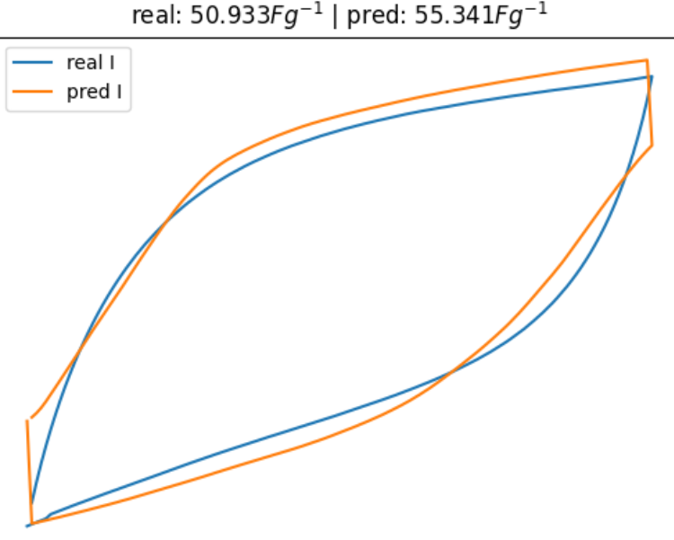

# ML-based Cyclic Voltammetry Curve Prediction
This repository implements a neural network model for predicting cyclic voltammetry (CV) current–voltage hysteresis loops from experimental conditions. Given electrode/material parameters and a voltage sweep, the model outputs the current for both forward and reverse scans.



## Overview

- **Input**: voltage $E$, sweep direction $d \in {+1, −1}$, and conditioning parameters (e.g., mass, temperature, electrolyte).
- **Output**: predicted current $I(E, d, x_c)$.
- Training data consists of 8 experimental CV curves (1 cycle each, 264 points).

The model is designed to interpolate between experiments and generate curves for unseen configurations.


## Cyclic Voltammetry Basics

In CV, potential is swept linearly:

```math
E(t) = E_0 + \nu t
```

where `ν` is the scan rate. The resulting loop of `I` vs `E` reflects both capacitive and faradaic processes, producing a characteristic hysteresis shape.

The energy associated with one cycle is proportional to the loop area:

```math
A = \oint I(E)\, dE
```

Or, equivalently:

```math
A = \int_{\text{forward}} I\, dE - \int_{\text{reverse}} I\, dE
```

To encourage smoothness in the generated output, higher-order derivatives of current are computed. Therefore, the obective function $\mathcal{L}$ is composed of two terms:
1. The data loss, which encourages matching the experimental traces, and
2. The smoothness loss, which penalises excessive jitter in the output   

Concretely, this is given by:
```math
\mathcal{L} = \lVert I_{pred} - I_{exp}\rVert_{2}^{2} + \lambda \Bigl\lVert\frac{\partial^2 I_{pred}}{\partial E^2}\Bigr\rVert_{2}^{2}
```
where $I_{pred}$ is the model's prediction, $I_{exp}$ is the true value from the experiment, and $\lambda$ is a scaling factor for the smoothness term.

## Setup
1. `conda env create -f environment.yml`
2. `conda activate cvml`
